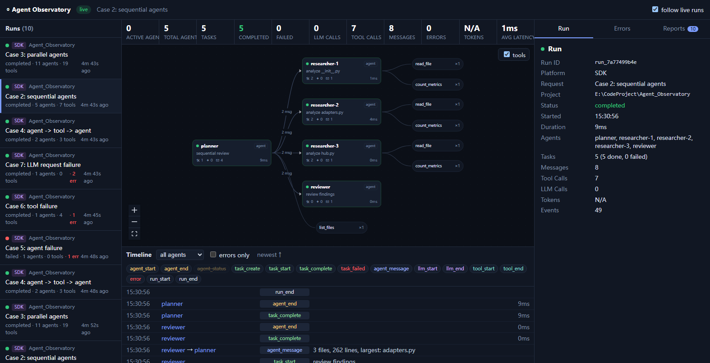
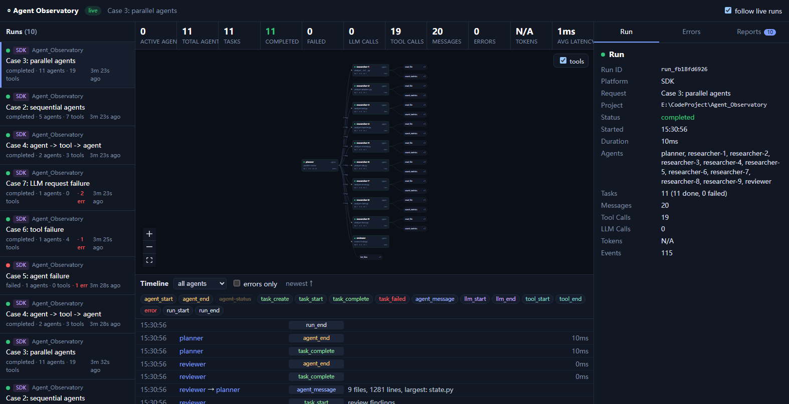
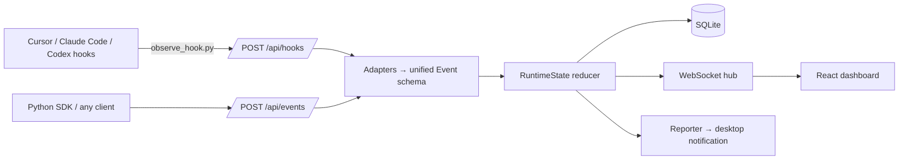

<div align="center">

# 🔭 Agent Observatory

**Local, real-time observability for multi-agent workflows in Cursor, Claude Code, Codex and your own Python agents.**

English | [简体中文](./README.zh-CN.md)

[](https://github.com/magau123/Agent_Observatory/stargazers)
[](https://github.com/magau123/Agent_Observatory/network/members)
[](https://github.com/magau123/Agent_Observatory/issues)
[](./LICENSE)
<br>


[Features](#-features) · [Quick Start](#-quick-start) · [Integrations](#-integrations) · [SDK](#-python-sdk) · [Configuration](#%EF%B8%8F-configuration) · [Roadmap](#-roadmap)

</div>

---

Agent Observatory hooks into the native hook systems of AI coding agents, so you don't change any project code. It captures sessions, subagents, tool calls, thoughts and failures. A live dashboard shows **who is working with whom, what each agent is doing, and what went wrong**. When a run finishes, it reports back to you.

> Everything shown comes from real events. Nothing is mocked or sampled. If a tool doesn't report token usage, the dashboard shows **N/A** instead of a guess.

<p align="center">
  
</p>

<details>
<summary>More: 11 agents running in parallel</summary>


</details>

## ✨ Features

- **Zero-intrusion integrations**: one installer wires up Cursor, Claude Code and Codex hooks. The hook script uses only the standard library and never blocks or breaks your agent, even if the server is down.
- **Agent graph**: React Flow and dagre lay out agents, subagent spawns, message flow and tool nodes, and highlight active edges live.
- **Subagent awareness**: child conversations fold into the parent run, and each subagent's tool calls are attributed to that subagent.
- **Timeline**: every event, with filters by type, agent and errors only, and expandable raw payloads.
- **Metrics and errors**: active agents, tasks, LLM and tool calls, latency, tokens and a dedicated error panel.
- **Reports**: a summary (currently in Chinese) when each run ends, delivered as a desktop notification. Periodic digests appear in the web Reports panel.
- **Persistent and replayable**: events are stored in local SQLite and replayed on restart. WebSocket clients reconnect automatically.
- **Python SDK**: a single-file, stdlib-only `Tracer` for LangGraph, CrewAI, AutoGen or hand-rolled agents.

## 🚀 Quick Start

**Requirements:** Python 3.12+ and Node.js 18+. Node is only needed to build the dashboard once.

```bash
git clone https://github.com/magau123/Agent_Observatory.git
cd Agent_Observatory

python -m venv .venv
# Windows: .\.venv\Scripts\activate    macOS/Linux: source .venv/bin/activate
pip install -r requirements.txt

python main.py          # builds the frontend on first run, then serves http://127.0.0.1:7777
```

Then connect your agents:

```bash
python hooks/install.py # auto-detects ~/.cursor, ~/.claude, ~/.codex
```

Open **http://127.0.0.1:7777** and start an agent session. It appears live.

<details>
<summary>Frontend dev mode</summary>

```bash
cd frontend
npm install
npm run dev             # http://localhost:5173, proxies /api and /ws to :7777
```
</details>

## 🔌 Integrations

| Tool | How | Status |
|---|---|---|
| **Cursor** | `~/.cursor/hooks.json` | ✅ Verified live (3.22) |
| **Claude Code** | `~/.claude/settings.json` | ✅ Tested against documented payloads |
| **Codex** | `~/.codex/hooks.json` + `[features] hooks = true` | ✅ Tested against documented payloads |
| **Custom Python agents** | `observatory/sdk.py` | ✅ 8 end-to-end scenarios |
| **Anything else** | `POST /api/events` | Schema at `GET /api/schema` |

```bash
python hooks/install.py cursor codex   # only these tools
python hooks/install.py --uninstall    # remove our entries, keep everyone else's
```

- Idempotent. A one-time `.bak` backup is written before a config file is first modified.
- **Codex:** approve the hooks once via `/hooks` inside Codex.
- One session becomes one **Run**. Subagents (Cursor subagents, Claude `Task`, Codex subagents) appear as child nodes of the main agent.

## 🐍 Python SDK

```python
from observatory.sdk import Tracer   # single file, stdlib only, copy it anywhere

tr = Tracer(title="Analyze document")
with tr.agent("planner") as planner:
    with tr.task(planner, "split work"):
        with tr.llm(planner, model="gpt-4o", input=prompt) as call:
            call.output, call.input_tokens, call.output_tokens = ...
        tr.message(planner, "researcher", "look up X")
tr.end()
```

Events are batched by a background thread. If the server is unreachable, they are dropped and your app keeps running. To see all 8 scenarios, run the demo: single agent, sequential, parallel, agent→tool→agent, agent failure, tool failure, LLM failure and concurrent runs.

```bash
python examples/multi_agent_demo.py
```

## 🏗️ Architecture



```text
observatory/   schema · adapters · state · store · hub · reporter · server · sdk
hooks/         observe_hook.py (hook entry) · install.py (installer)
frontend/      React 19 + TypeScript + Vite + React Flow dashboard
examples/      multi_agent_demo.py
tests/         integration tests (real server + real hook subprocesses)
```

## ⚙️ Configuration

| Variable | Default | Description |
|---|---|---|
| `OBSERVATORY_HOST` / `OBSERVATORY_PORT` | `127.0.0.1` / `7777` | Server address |
| `OBSERVATORY_URL` | `http://127.0.0.1:7777` | Where hooks and the SDK send events |
| `OBSERVATORY_DB` | `data/observatory.db` | SQLite path, replayed on restart |
| `OBSERVATORY_REPORT_INTERVAL_MIN` | `30` | Periodic digest interval, web only. Set `0` to disable |
| `OBSERVATORY_NOTIFY` | `1` | Set `0` to disable desktop notifications |
| `OBSERVATORY_NOTIFY_MIN_SECONDS` | `20` | Only notify for runs at least this long, or for failures |

Run `python main.py report` to print a digest in the terminal.

## 🧪 Testing

```bash
python tests/test_observatory.py
```

The tests start a real server and run the real hook script as a subprocess. They cover:

- Cursor, Claude Code and Codex payloads
- Subagent linking and folding
- Windows non-ASCII payload recovery
- The 8 SDK scenarios
- Schema validation and WebSocket

## ⚠️ Known Limitations

- The Cursor, Claude Code and Codex hooks don't expose token usage, so tokens show as N/A. The SDK reports real values.
- Cursor doesn't fire hooks for some tool calls made inside subagents, and those calls can't be observed.
- On Windows, Cursor decodes non-ASCII hook input as the ANSI code page. The hook script recovers the original text from Cursor's temporary payload file.

## 🗺️ Roadmap

- [x] Dashboard screenshots
- [ ] Demo GIF
- [ ] Token and cost extraction from transcript files where available
- [ ] Export a run as JSON or HTML
- [ ] More integrations (Gemini CLI, OpenCode, …)

## 🤝 Contributing

Issues and pull requests are welcome. Please use [Conventional Commits](https://www.conventionalcommits.org/) and run the tests before opening a PR.

- 🐛 [Report a bug](https://github.com/magau123/Agent_Observatory/issues/new)
- 💡 [Request a feature](https://github.com/magau123/Agent_Observatory/issues/new)

## ⭐ Star History

If this project helps you, please give it a star. It really helps.

[](https://star-history.com/#magau123/Agent_Observatory&Date)

## 📄 License

[MIT](./LICENSE) © 2026 magua
