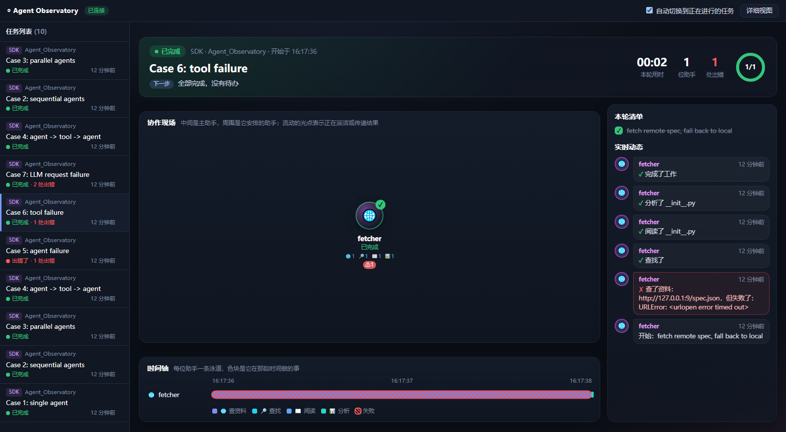
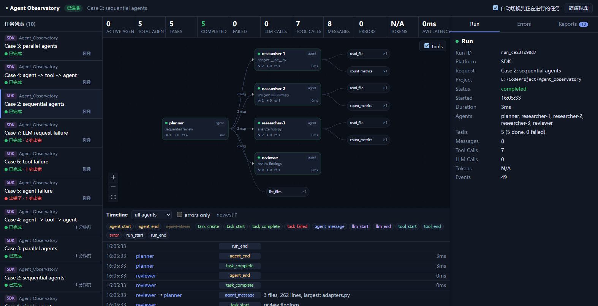
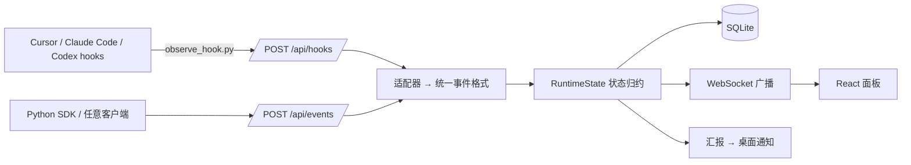

<div align="center">

# 🔭 Agent Observatory

**本地运行、实时可视化的多 Agent 工作流观测平台，支持 Cursor、Claude Code、Codex 以及你自己的 Python Agent。**

[English](./README.md) | 简体中文

[](https://github.com/magau123/Agent_Observatory/stargazers)
[](https://github.com/magau123/Agent_Observatory/network/members)
[](https://github.com/magau123/Agent_Observatory/issues)
[](./LICENSE)
<br>


[功能特性](#-功能特性) · [快速开始](#-快速开始) · [工具接入](#-工具接入) · [SDK](#-python-sdk) · [配置](#%EF%B8%8F-配置) · [路线图](#%EF%B8%8F-路线图)

</div>

---

Agent Observatory 通过 AI 编程工具自带的 hooks 采集数据，不需要改动你的任何项目代码。它会采集会话、子 agent、工具调用、思考和失败事件，在实时面板上展示**谁在和谁协作、每个 agent 在做什么、哪里出了问题**，并在运行结束时向你汇报。

> 面板上的所有数据都来自真实事件，没有模拟或随机数据。工具不提供 token 用量时显示 **N/A**，不做估算。

<p align="center">
  
</p>
<p align="center"><sub>一次真实的 Cursor 会话：主助手（中间）派出了 5 个助手，气泡说明每个助手此刻在做什么，下方泳道显示谁在并行工作。</sub></p>

<details>
<summary>更多：11 个助手并行 · 出错时的样子 · 给开发者的详细视图</summary>

**11 个助手并行**


**出错了：用大白话说明哪里出了问题**



**详细视图**：agent 关系图、原始时间线与指标


</details>

## ✨ 功能特性

- **零侵入接入**：一条安装命令即可接入 Cursor、Claude Code 和 Codex 的 hooks。hook 脚本只用标准库，服务没开也不会阻塞或影响你的 agent。
- **协作现场（默认视图）**：主助手在中央，它派出的助手环绕在周围。
  - 每个助手都是一个会动的角色：外圈在转表示正在工作，头顶的气泡说明它在做什么，小图标表示在做哪类事（📖 阅读、✏️ 修改、⌨️ 运行命令、🌐 查资料）。
  - 派活和交回结果时，连线上会有光点流动。
- **泳道时间轴**：每位助手一条泳道，共用一条时间轴，谁在什么时候并行做了什么一目了然。
- **大白话动态与清单**：聊天气泡式的实时动态，加上本轮任务清单，没有专业术语，人人都能看懂。
- **给开发者的详细视图**：右上角一键切换。
- **Agent 关系图**：用 React Flow + dagre 自动布局，展示 agent、子 agent 的派生关系、消息流和工具节点，活跃的连线会实时高亮。
- **识别子 agent**：子会话会自动合并进父 run，子 agent 内部的工具调用归到它自己名下。
- **时间线**：列出全部事件，可以按事件类型、agent 过滤，或只看错误；每条事件可以展开查看原始数据。
- **指标与错误监控**：活跃 agent、任务、LLM 和工具调用次数、延迟、token，另有独立的错误面板。
- **运行汇报**：每次运行结束时生成中文汇报并弹桌面通知；定时摘要只显示在网页的 Reports 面板里。
- **持久化与回放**：数据保存在本地 SQLite，重启后自动回放；WebSocket 断线会自动重连。
- **Python SDK**：单文件、只依赖标准库的 `Tracer`，适用于 LangGraph、CrewAI、AutoGen 或自研的多 agent 程序。

## 🚀 快速开始

**环境要求：** Python 3.12+、Node.js 18+（Node 只在首次构建前端时用到）。

```bash
git clone https://github.com/magau123/Agent_Observatory.git
cd Agent_Observatory

python -m venv .venv
# Windows: .\.venv\Scripts\activate    macOS/Linux: source .venv/bin/activate
pip install -r requirements.txt

python main.py          # 首次运行会自动构建前端，然后在 http://127.0.0.1:7777 提供服务
```

接入你的 agent 工具：

```bash
python hooks/install.py # 自动检测 ~/.cursor、~/.claude、~/.codex
```

打开 **http://127.0.0.1:7777**，然后开始一个 agent 会话，它会实时出现在面板上。

<details>
<summary>前端开发模式</summary>

```bash
cd frontend
npm install
npm run dev             # http://localhost:5173，/api 与 /ws 代理到 :7777
```
</details>

## 🔌 工具接入

| 工具 | 接入方式 | 状态 |
|---|---|---|
| **Cursor** | `~/.cursor/hooks.json` | ✅ 本机实测（3.22） |
| **Claude Code** | `~/.claude/settings.json` | ✅ 按官方文档 payload 测试 |
| **Codex** | `~/.codex/hooks.json` + `[features] hooks = true` | ✅ 按官方文档 payload 测试 |
| **自研 Python Agent** | `observatory/sdk.py` | ✅ 8 个端到端场景 |
| **其他任意程序** | `POST /api/events` | 字段格式见 `GET /api/schema` |

```bash
python hooks/install.py cursor codex   # 只接入指定工具
python hooks/install.py --uninstall    # 只移除本工具的条目，保留你的其他 hooks
```

- 可以重复执行；首次修改配置文件前会备份为 `.bak`。
- **Codex：** 需要在 Codex 里用 `/hooks` 批准一次。
- 一次会话对应一个 **Run**；子 agent（Cursor subagent、Claude `Task`、Codex subagent）作为子节点挂在主 agent 下面。

## 🐍 Python SDK

```python
from observatory.sdk import Tracer   # 单文件、仅标准库，可以直接拷到任何项目

tr = Tracer(title="分析文档")
with tr.agent("planner") as planner:
    with tr.task(planner, "拆分任务"):
        with tr.llm(planner, model="gpt-4o", input=prompt) as call:
            call.output, call.input_tokens, call.output_tokens = ...
        tr.message(planner, "researcher", "查一下 X")
tr.end()
```

事件由后台线程批量发送；服务连不上时直接丢弃，不影响你的程序运行。运行下面的示例可以看到全部 8 个场景：单 agent、串行、并行、agent→tool→agent、agent 失败、工具失败、LLM 失败、多个 run 并发。

```bash
python examples/multi_agent_demo.py
```

## 🏗️ 架构



```text
observatory/   schema · adapters · state · store · hub · reporter · server · sdk
hooks/         observe_hook.py（hook 入口）· install.py（安装器）
frontend/      React 19 + TypeScript + Vite + React Flow 面板
examples/      multi_agent_demo.py
tests/         集成测试（真实服务 + 真实 hook 子进程）
```

## ⚙️ 配置

| 环境变量 | 默认值 | 说明 |
|---|---|---|
| `OBSERVATORY_HOST` / `OBSERVATORY_PORT` | `127.0.0.1` / `7777` | 服务地址 |
| `OBSERVATORY_URL` | `http://127.0.0.1:7777` | hook 脚本和 SDK 的上报地址 |
| `OBSERVATORY_DB` | `data/observatory.db` | SQLite 路径，重启后回放 |
| `OBSERVATORY_REPORT_INTERVAL_MIN` | `30` | 定时摘要间隔，只在网页显示；设为 `0` 关闭 |
| `OBSERVATORY_NOTIFY` | `1` | 设为 `0` 关闭桌面通知 |
| `OBSERVATORY_NOTIFY_MIN_SECONDS` | `20` | 运行时长达到这个秒数或者失败时才弹通知 |

在终端运行 `python main.py report` 可以打印一份摘要。

## 🧪 测试

```bash
python tests/test_observatory.py
```

测试会启动真实的服务，并以子进程运行真实的 hook 脚本，覆盖：

- Cursor、Claude Code、Codex 三种工具的 payload
- 子 agent 的关联与合并
- Windows 中文乱码恢复
- 8 个 SDK 场景
- 数据校验与 WebSocket

## ⚠️ 已知限制

- Cursor、Claude Code、Codex 的 hooks 都不提供 token 用量，所以显示 N/A；通过 SDK 上报时会显示真实数值。
- Cursor 对子 agent 内部的部分工具调用不触发 hook，这部分调用看不到。
- Windows 上 Cursor 会把含中文的 hook 输入按系统 ANSI 编码误解码，hook 脚本会从 Cursor 的临时 payload 文件恢复原文。

## 🗺️ 路线图

- [x] 面板截图
- [ ] 演示 GIF
- [ ] 从对话记录文件中提取 token 与成本（在能拿到的情况下）
- [ ] 导出 Run 为 JSON 或 HTML
- [ ] 接入更多工具（Gemini CLI、OpenCode 等）

## 🤝 参与贡献

欢迎提交 Issue 和 Pull Request。提交信息请遵循 [Conventional Commits](https://www.conventionalcommits.org/zh-hans/)，提 PR 前请先跑一遍测试。

- 🐛 [报告问题](https://github.com/magau123/Agent_Observatory/issues/new)
- 💡 [功能建议](https://github.com/magau123/Agent_Observatory/issues/new)

## ⭐ Star 趋势

如果这个项目对你有帮助，请点个 Star 支持一下，这对项目很重要。

[](https://star-history.com/#magau123/Agent_Observatory&Date)

## 📄 许可证

[MIT](./LICENSE) © 2026 magua
